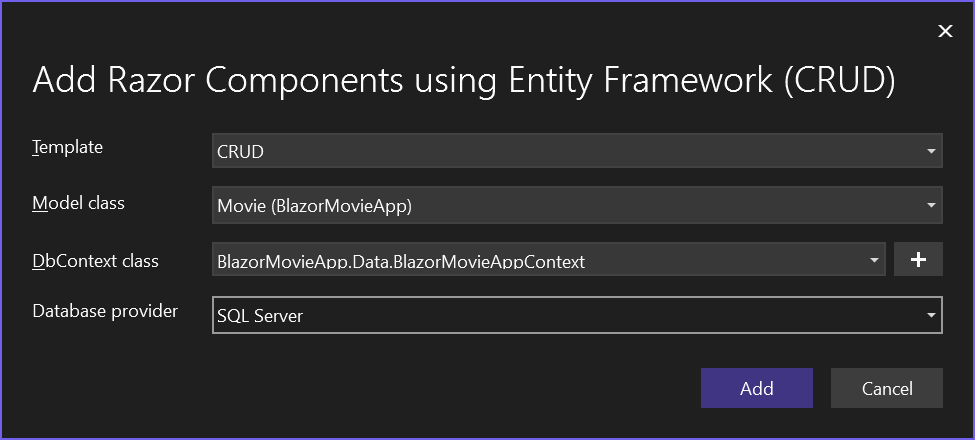

Component->Pages 
Add->New Scaffolded Item... 
Razor Component->Razor Components using Entity Framework (CRUD)->Add- 

Template->CRUD 
Model class->Movie class 
DbContext class->+->Add 
Database provider->SQL Server 

Tool->NuGet Package Manager->Package Manager Console 
PM> Add-Migration Movie 
PM> Update-Database 

# QuickGrid

[QuickGrid for Blazor](https://aspnet.github.io/quickgridsamples/)

